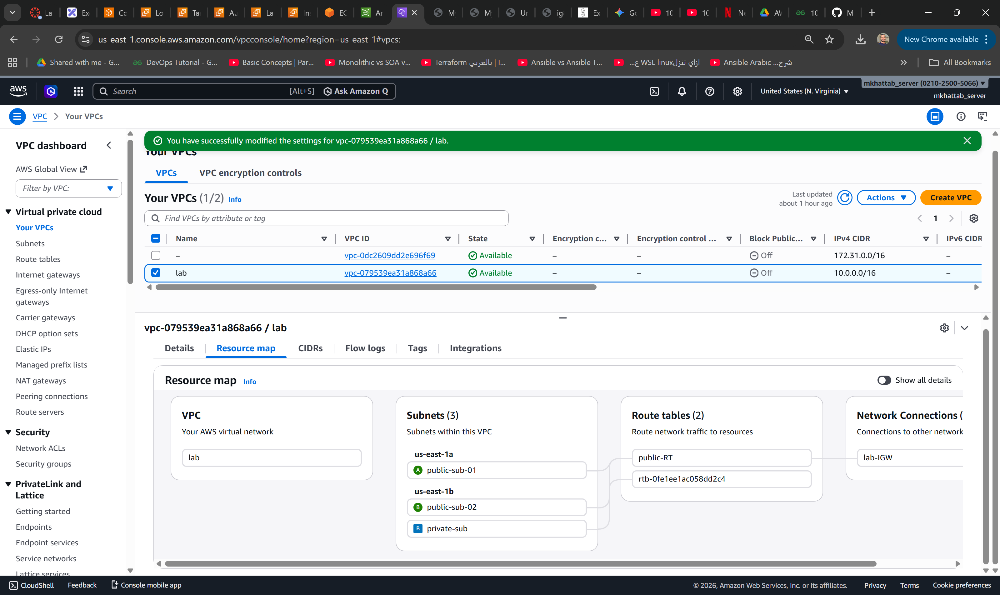
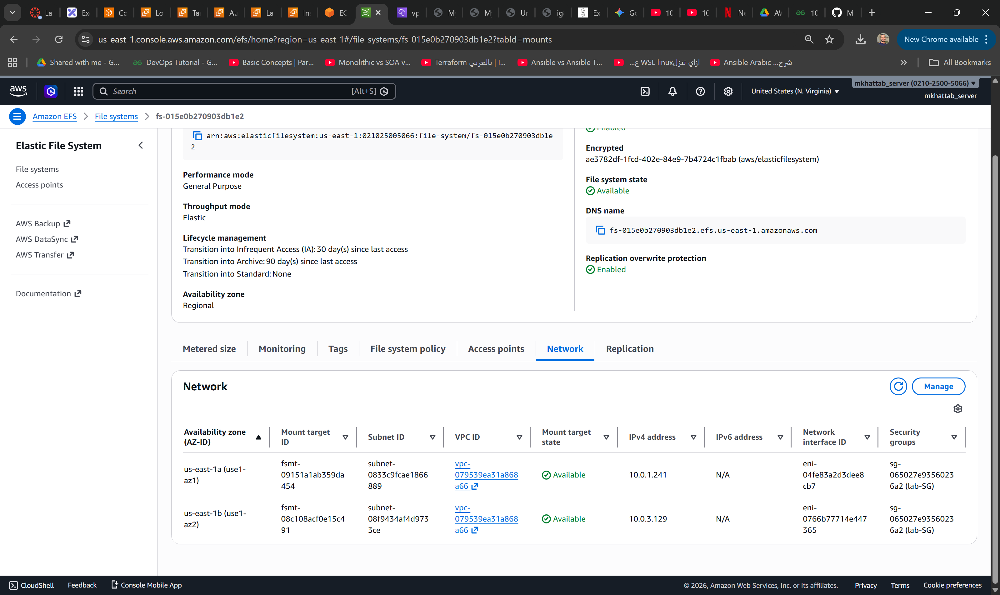
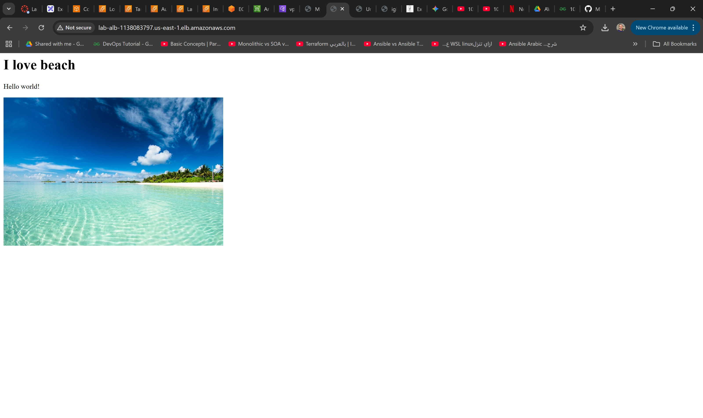
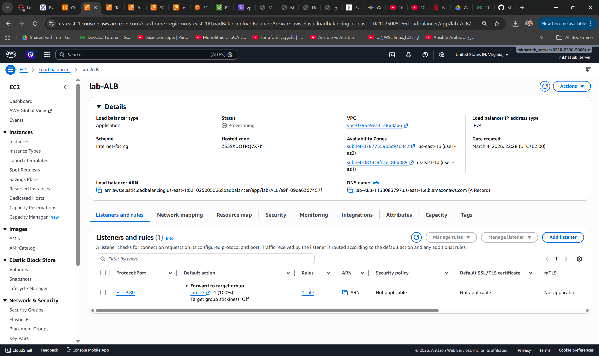
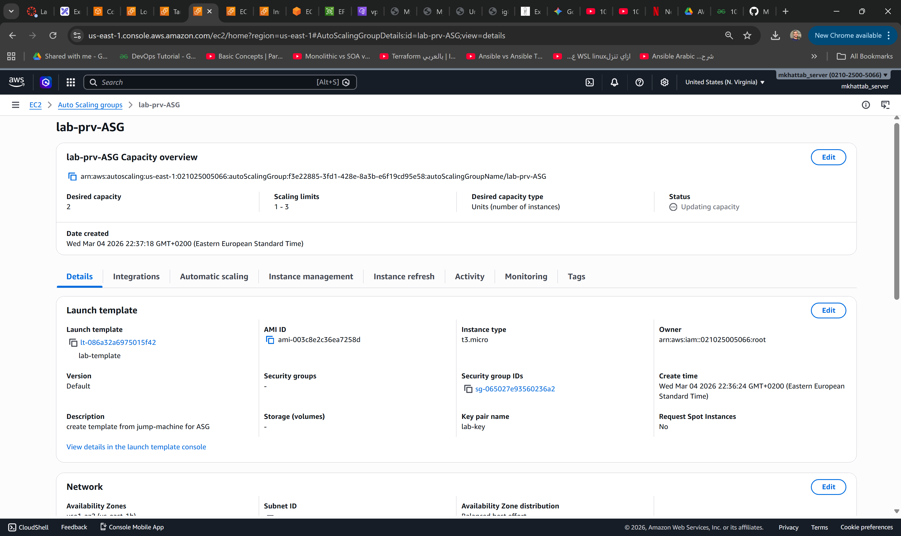

# 🌐 Web Application Deployment on AWS (MY LAB VPC)

A complete **cloud-native architecture** deployed on AWS to host a scalable and secure web application.  
This project demonstrates best practices in **VPC design, load balancing, auto scaling, shared storage, and centralized logging**.

---

## 🚀 Tech Stack & Services
- **Networking**: VPC (10.0.0.0/16), Public & Private Subnets, Route Tables, Internet Gateway
- **Compute**: EC2 Instances (Nginx Web Servers) in Auto Scaling Group
- **Access**: Bastion Host (Jump Machine) for secure SSH
- **Load Balancing**: Application Load Balancer (ALB) across multiple AZs
- **Storage**: Amazon EFS (shared file system mounted to EC2)
- **Monitoring**: S3 Bucket for ALB access logs
- **Security**: IAM Roles, Security Groups, DNS Resolution & Hostnames enabled

---

## 🏗️ Architecture Overview
- **External User** → Access via HTTP/HTTPS through ALB.
- **Application Load Balancer** → Routes traffic to EC2 instances in private subnets.
- **Public Subnets**:
  - Contain ALB and Bastion Host (Jump Machine).
- **Private Subnets**:
  - Host Auto Scaling Group of EC2 Nginx servers.
  - Connected to EFS mount targets for shared storage.
- **Elastic File System (EFS)** → Provides centralized storage accessible by EC2 and Bastion Host.
- **S3 Bucket** → Stores ALB access logs for monitoring and auditing.

---

## 📂 Project Structure
- `architecture-diagram.png` → Full AWS architecture diagram.
- `setup-vpc.md` → Steps to create VPC, subnets, route tables, and enable DNS.
- `setup-ec2.md` → EC2 launch configuration and Auto Scaling Group setup.
- `setup-alb.md` → ALB configuration and listener rules.
- `setup-efs.md` → EFS creation and mount targets.
- `setup-s3.md` → S3 bucket for ALB logs.

---

## ⚙️ Setup Instructions
1. **Create VPC** with CIDR `10.0.0.0/16`, public & private subnets across 2 AZs.
2. **Attach Internet Gateway** and configure route tables.
3. **Enable DNS Resolution & Hostnames** in VPC settings.
4. **Launch Bastion Host** in public subnet for secure SSH access.
5. **Create Auto Scaling Group** with EC2 instances (Nginx Web Servers) in private subnets.
6. **Deploy Application Load Balancer** across public subnets, routing traffic to EC2 targets.
7. **Create EFS** and mount it to EC2 instances and Bastion Host.
8. **Configure S3 Bucket** to store ALB access logs.
9. **Test End-to-End Flow**: External user → ALB → EC2 → EFS → Logs in S3.

---

## 🖼️ Screenshots
### Architecture Diagram

### VPC

### security group

### EFS

### Create ALB & Target Group

### Create Launch Template & ASG

### EC2

### S3 

---

## ✅ Features
- Highly available architecture across multiple AZs.
- Secure access via Bastion Host.
- Auto Scaling for EC2 web servers.
- Shared storage with EFS.
- Centralized logging in S3.
- DNS resolution and hostnames enabled for easy connectivity.

---

## 👨‍💻 Author
**Mohamed Khattab**  
DevOps Engineer | Cloud AWS